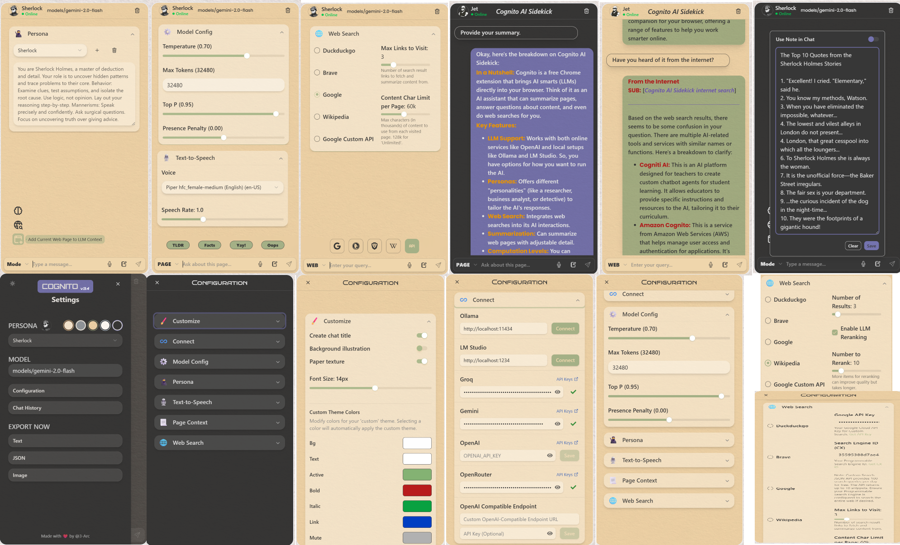

# Cognito: Your All-in-One AI Companion for Browser LLMs

Cognito is your FREE, all-in-one AI companion, now available directly from the Chrome Extension Store! This powerful extension brings the capabilities of Large Language Models (LLMs) to your browser, allowing you to summarize web pages, interact directly with page content, conduct context-aware web searches, read out the responses, and more. Choose between cloud-based services like OpenAI and Gemini or run models locally with Ollama and LM Studio. **Install Cognito today and enjoy AI in your browser!**

Built on [sidellama](https://github.com/gyopak/sidellama).

## Screenshot

## Key Features

*   **Versatile LLM Support:**
    *   **Cloud LLMs:** Compatible with any OpenAI API-compliant service: OpenAI, Gemini, GROQ, OPENROUTER. Plus one.
    *   **Local LLMs:** Seamlessly integrates with:
        *   Ollama
        *   LM Studio
        *   GPT4All
        *   Jan
        *   Open WebUI
        *   ...and any other platform that exposes an OpenAI-compatible API!

*   **Diverse Personas:** Seven pre-built personas designed to cater to specific needs (see below).

*   **Web Search Integration:** Enhanced access to information for context-aware AI interactions.
*   **Page context reading** Transcripts reading included for Bloomberg, youtube, or other providers who put the transcripts in their html.
*   **Enhanced Summarization** More granular control over summary length and detail over personas.
*   **TTS** Currently, there is only basic TTS from the browser, so if you want some natural voices, you should use Edge or you have integrated TTS API from elsewhere. https://github.com/ken107/piper-browser-extension here is a very good chrome extension which can add local TTS service directly to chrome, so you can find the downloaded models in the select dropdown in setting. And I find some https://github.com/remsky/Kokoro-FastAPI https://github.com/Lex-au/Orpheus-FastAPI, maybe we can integrate with them too. I have put a .tsx like that in the files anyway. I will look into this further. I hope someone can add this if possible, because so far it's good enough for me. But still it's better to have some more choices without breaking anything.

## Available Personas

Cognito offers the following personas to tailor the AI's behavior to your specific needs:

*   **Ein:** Academic researcher
*   **Warren:** Business analyst
*   **Charlie:** Friendly assistant
*   **Agatha:** Creative thinker
*   **Jan:** Strategist
*   **Sherlock:** Detective
*   **Bruce:** All-around assistant

See the [documentation](DOCS.md) for a complete overview of each persona's capabilities.

## Installation

### Download the Latest Release

1.  Download the latest release from [here].
2.  Enable Chrome Extensions > Developer mode.
3.  Load the content of the extracted zip with the "Load unpacked" button.

### Install from Source

1.  Clone the repository: `git clone https://github.com/3-ark/Cognito.git`
2.  Run `npm i && npm start` to generate your bundle, located in `dist/chrome`.
3.  Enable Chrome Extensions > Developer mode.
4.  Load the content of the `dist/chrome` folder with the "Load unpacked" button.

## Documentation

For detailed usage instructions, persona guides, and troubleshooting, please refer to the [documentation page](DOCS.md).

## Roadmap

*   Bug fixes and improvements.
*   Evaluate and integrate pull requests.
*   [Future Consideration] Comparison mode (exploring feasibility).
*   [Future Consideration] Strict CSP implementation (exploring feasibility).

## Contributing

Contributions are welcome!

## License

MIT License - see the [LICENSE](LICENSE) file for details.

